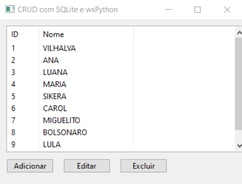
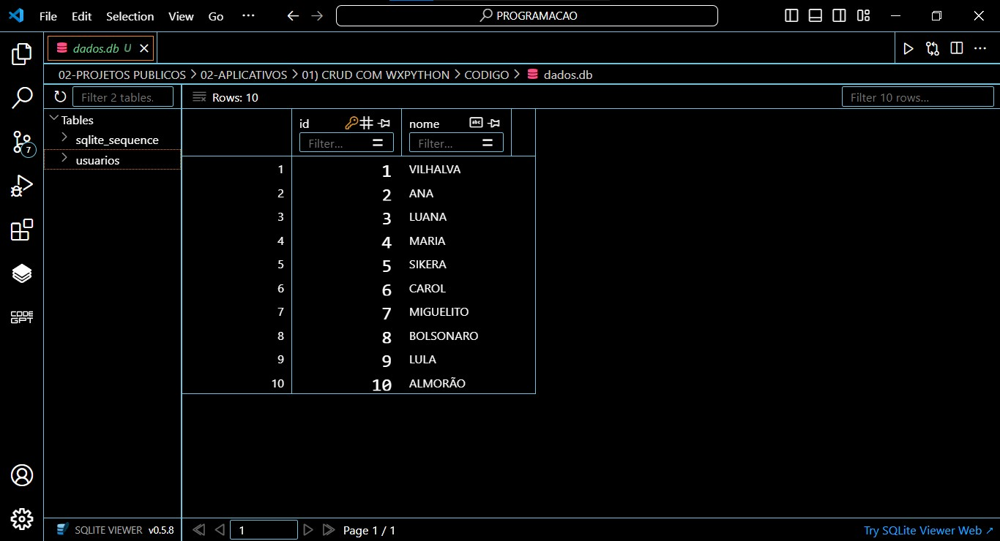

# CRUD COM WXPYTHON
👨‍🏫CRUD DE NOMES DE USUÁRIOS COM WXPYTHON E SQLITE.

  
  

## DESCRIÇÃO:
O projeto é um aplicativo de CRUD (Create, Read, Update, Delete) desenvolvido com wxPython e SQLite, permitindo gerenciar uma lista de usuários através de uma interface gráfica.

## FUNCIONALIDADES:
1. **Listagem de Usuários:**
   - Exibe uma lista de usuários cadastrados em uma tabela.
   
2. **Adicionar Usuário:**
   - Permite adicionar um novo usuário inserindo seu nome através de um diálogo de entrada de texto.
   
3. **Editar Usuário:**
   - Permite editar o nome de um usuário existente selecionado na lista, através de um diálogo de entrada de texto.
   
4. **Excluir Usuário:**
   - Permite excluir um usuário existente selecionado na lista.
   
## COMO USAR?
1. **Adicionar Usuário:**
   - Clique no botão "Adicionar".
   - Digite o nome do novo usuário no diálogo que aparece e clique em "OK".

2. **Editar Usuário:**
   - Selecione um usuário na lista.
   - Clique no botão "Editar".
   - Digite o novo nome para o usuário no diálogo que aparece e clique em "OK".

3. **Excluir Usuário:**
   - Selecione um usuário na lista.
   - Clique no botão "Excluir".

## NÃO SABE?
- Entendemos que para manipular arquivos em muitas linguagens e tecnologias, é necessário possuir conhecimento nessas áreas. Para auxiliar nesse aprendizado, oferecemos cursos gratuitos disponíveis:
* [CURSO DE PYTHON](https://github.com/VILHALVA/CURSO-DE-PYTHON)
* [CURSO DE WXPYTHON](https://github.com/VILHALVA/CURSO-DE-WXPYTHON)
* [CURSO DE SQLITE](https://github.com/VILHALVA/CURSO-DE-SQLITE)
* [CONFIRA MAIS CURSOS](https://github.com/VILHALVA?tab=repositories&q=+topic:CURSO)

## CREDITOS:
- [PROJETO CRIADO PELO VILHALVA](https://github.com/VILHALVA)

